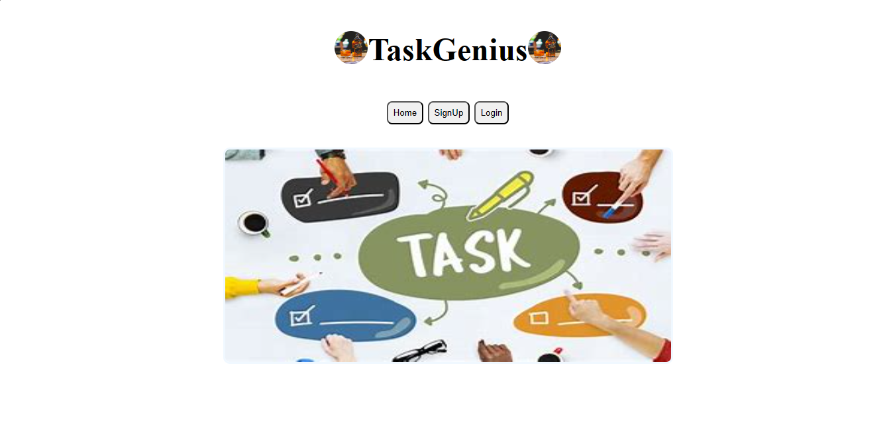

# TaskGenius Application

This is a Task Tracking Application created using React.js, Firebase, and JavaScript.

## Dependencies

Make sure you have the following dependencies installed before running the application:

- React
- ReactDOM
- NPM

## Hosted Website URL
https://taskgenius.onrender.com

## Getting Started

Follow these steps to get the application up and running:

1. Clone this repository to your local machine.
2. Open your terminal and navigate to the project directory.
3. Run the following command to install the required dependencies:
